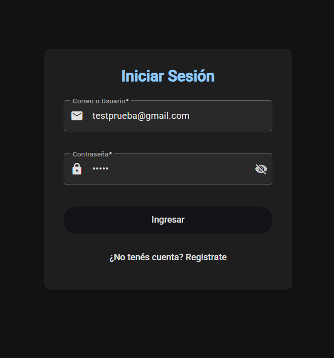
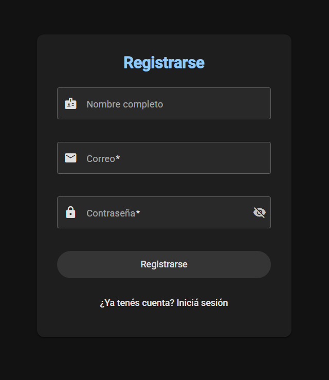
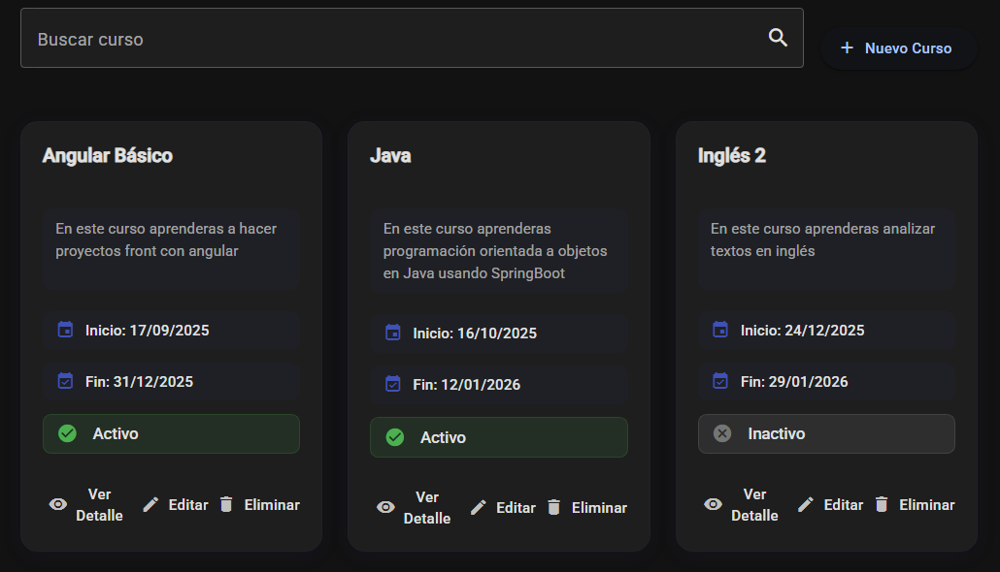
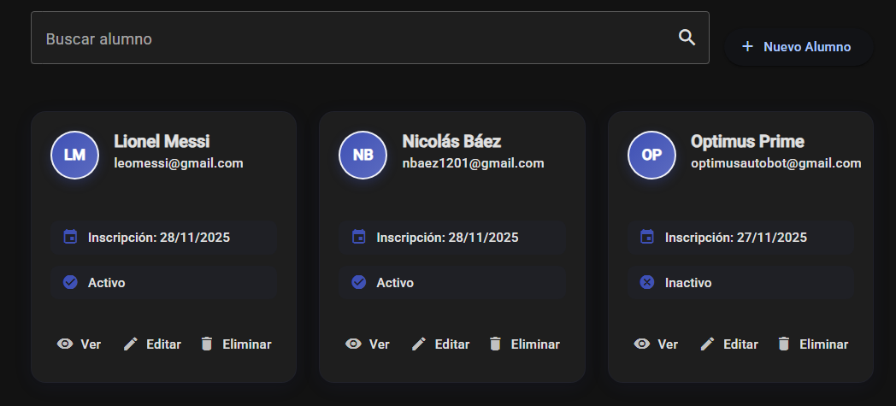
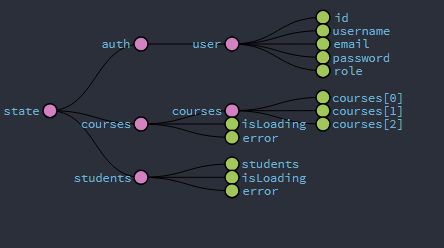
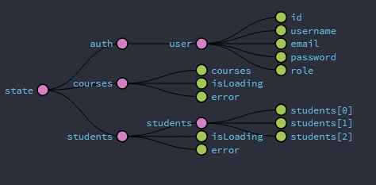
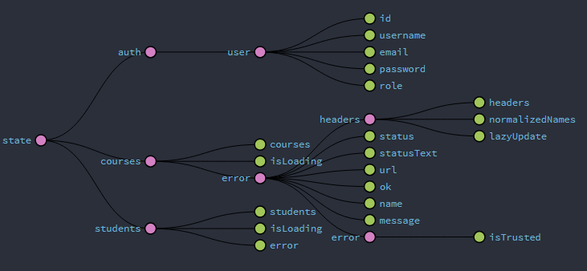

# PF-Angular-Baez — Sistema de Gestión Educativa

**Nicolás Báez** | Proyecto Final - Angular CoderHouse

Aplicación web completa para administración académica con arquitectura Redux: CRUD de Alumnos y Cursos, autenticación con NgRx Store (global + feature stores), Effects con loading states, guards de protección de rutas, gestión de sesión con expiración automática, API REST con JSON Server, arquitectura modular (Core, Features, Shared), lazy loading, testing unitario completo, formularios reactivos y Angular Material para interfaz moderna con soporte de tema claro/oscuro.

---

## 🚀 Ejecución

### Pasos para ejecutar

1. **Clonar el repositorio**
```bash
git clone https://github.com/114032-Baez-Nicolas/PF-Angular-Baez.git
cd PF-Angular-Baez
```

2. **Instalar dependencias**
```bash
npm install
```

3. **Ejecutar JSON Server (Base de datos)**
```bash
json-server --watch data/db.json --port 3000
```

4. **Ejecutar la aplicación Angular**
```bash
ng serve
```

5. **Abrir en el navegador**
```
http://localhost:4200/login
```

### Credenciales de prueba

**Usuario 1 (con username):**
- **Email/Usuario:** `Nicolas`
- **Contraseña:** `1234p`

**Usuario 2 (con email):**
- **Email/Usuario:** `testprueba@gmail.com`
- **Contraseña:** `1234p`

---

## 🛠️ Tecnologías

- **Angular** 20.3.2
- **Angular Material** - UI Components
- **NgRx Store** - Gestión de estado con Redux
- **NgRx Effects** - Manejo de side effects
- **TypeScript** - Lenguaje principal
- **JSON Server** - API REST simulada
- **SweetAlert2** - Notificaciones
- **UUID** - Identificadores únicos
- **Jasmine** - Testing unitario
- **RxJS** - Programación reactiva

---

## ⚡ Funcionalidades

### Redux/NgRx Store

- ✅ **Store Global (Auth)**: Gestión centralizada de autenticación
- ✅ **Feature Stores**: 
  - `courses` (Cursos)
  - `students` (Alumnos)
- ✅ **Effects con Delay**: Loading en carga de datos
- ✅ **Actions, Reducers, Selectors**: Patrón completo Redux
- ✅ **Redux DevTools**: Integración para debugging

### Autenticación y Sesión

- ✅ Login con **email O username**
- ✅ Registro de usuarios
- ✅ Sesión con **expiración de 30 minutos** de inactividad
- ✅ Persistencia en localStorage con validación
- ✅ Guards protegiendo rutas privadas

### Gestión Académica

- ✅ **CRUD completo de Alumnos** con NgRx Store
- ✅ **CRUD completo de Cursos** con NgRx Store
- ✅ Búsqueda y filtrado en tiempo real
- ✅ Loading "Procesando..." durante operaciones
- ✅ Estados visuales (activo/inactivo)
- ✅ Interfaz responsive con cards modernas

### Arquitectura

- ✅ **Lazy Loading** con rutas child
- ✅ **Arquitectura modular**: Core, Features, Shared
- ✅ **Testing completo**: 30 tests unitarios pasando
- ✅ **Formularios reactivos** con validaciones
- ✅ **Pipes personalizados**: nombreCompleto
- ✅ **Directivas personalizadas**: tituloResaltado

---

## 🎥 Video Demostración

[Video demostrativo del proyecto](VIDEO)

---

## 📸 Capturas de Pantalla

### Login

*Sistema de autenticación con modo oscuro y login flexible (email o username)*

### Registro

*Formulario de registro de usuarios*

### Gestión de Cursos

*Lista de cursos con búsqueda, estados y loading de NgRx*

### Gestión de Alumnos

*Lista de alumnos con acciones CRUD y feature store*

### Redux DevTools - State Completo

*Vista completa del state con auth global y feature stores (courses, students)*

### Redux DevTools - Cursos Cargados

*Feature store de cursos con array de datos y loading state*

### Redux DevTools - Error Handling

*Manejo de errores en el state de Redux*

---

## 📂 Estructura del Proyecto

```
src/app/
├── core/           # Servicios, guards, modelos, store
├── features/       # Módulos de funcionalidad
│   ├── auth/       # Autenticación
│   ├── alumnos/    # Gestión de alumnos
│   ├── cursos/     # Gestión de cursos
│   └── dashboard/  # Página de inicio
├── shared/         # Pipes, directivas, componentes compartidos
└── layout/         # Navbar, toolbar
```

---

## 🧪 Testing

### Ejecutar tests unitarios:
```bash
ng test
```

### Cobertura de testing:
```
✅ 30 tests unitarios (100% passing)
✅ 3 servicios testeados (Auth, Cursos, Alumnos)
✅ 6 componentes visuales testeados
✅ 1 pipe testeado
```

---

## 📋 Requisitos Proyecto Final 

- [x] **NgRx Store Global** (auth) con usuario logueado
- [x] **Feature Stores** (cursos, alumnos) con effects
- [x] **Effects con delay** en carga de datos
- [x] **Loading state** "Procesando..." durante operaciones
- [x] **Testing unitario** - 30 tests
- [x] **Actions, Reducers, Selectors** en todos los stores
- [x] **Componente de Login** con autenticación
- [x] **Guards** protegiendo rutas privadas
- [x] **API REST** con JSON Server
- [x] **Lazy Loading** y rutas child
- [x] **CRUD completo** de alumnos y cursos

---

## ⚠️ Notas

- La aplicación requiere **JSON Server** ejecutándose en puerto 3000
- **No deployada** en Vercel/GitHub Pages debido a la dependencia de JSON Server local
- Usar credenciales de prueba para acceder al sistema
- El proyecto está optimizado para demostración académica
- Redux DevTools: Instalar extensión de navegador para debugging

---

**Nicolás Báez** - CoderHouse Angular
