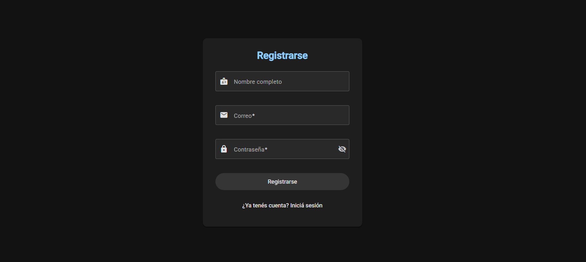

# PF-Angular-Baez – Sistema de Gestión Educativa

**Nicolás Báez** | Proyecto Final - Angular CoderHouse

Aplicación web completa para administración académica con arquitectura Redux (NgRx), CRUD de Alumnos y Cursos, autenticación con roles (Admin/Usuario), gestión de sesión con expiración automática, API REST con JSON Server, testing unitario completo y Angular Material con tema claro/oscuro.

---

## 🎥 Video Demostración

[Ver video del proyecto](URL_DEL_VIDEO)

---

## 📸 Capturas de Pantalla

<div align="center">

### Login


### Registro


### Gestión de Cursos


### Gestión de Alumnos


### Redux DevTools


</div>

---

## 🚀 Instalación y Ejecución

### 1. Clonar el repositorio
```bash
git clone https://github.com/114032-Baez-Nicolas/PF-Angular-Baez.git
cd PF-Angular-Baez
```

### 2. Instalar dependencias
```bash
npm install
```

### 3. Ejecutar JSON Server (Base de datos)
```bash
json-server --watch data/db.json --port 3000
```

### 4. Ejecutar la aplicación Angular
```bash
ng serve
```

### 5. Abrir en el navegador
```
http://localhost:4200
```

---

## 🔐 Credenciales de Prueba

**Administrador:**
- Usuario: `admin@gmail.com`
- Contraseña: `1234pixel`

**Usuario:**
- Usuario: `user@gmail.com`
- Contraseña: `1234pixel`

---

## 🛠️ Tecnologías

| Tecnología | Versión | Uso |
|------------|---------|-----|
| **Angular** | 20.3.2 | Framework principal |
| **Angular Material** | 20.x | Componentes UI |
| **NgRx Store** | - | Gestión de estado Redux |
| **TypeScript** | - | Lenguaje principal |
| **JSON Server** | - | API REST simulada |
| **SweetAlert2** | - | Notificaciones |
| **Jasmine/Karma** | - | Testing unitario |
| **RxJS** | - | Programación reactiva |

---

## ⚡ Funcionalidades

### Sistema de Roles
- ✅ **Administrador**: CRUD completo de cursos, alumnos y usuarios
- ✅ **Usuario**: Solo visualización de detalles

### Redux/NgRx Store
- ✅ Store Global (Auth) con usuario logueado
- ✅ Feature Stores (courses, students) con Effects
- ✅ Actions, Reducers, Selectors
- ✅ Loading states con "Procesando..."
- ✅ Redux DevTools integrado

### Autenticación y Sesión
- ✅ Login con email O username
- ✅ Registro de usuarios (rol Usuario por defecto)
- ✅ Expiración de sesión (30 minutos de inactividad)
- ✅ Guards protegiendo rutas privadas

### Gestión Académica
- ✅ CRUD completo de Alumnos
- ✅ CRUD completo de Cursos
- ✅ Búsqueda en tiempo real
- ✅ Estados visuales (activo/inactivo)
- ✅ Interfaz responsive con cards

### Características Técnicas
- ✅ Lazy Loading con rutas child
- ✅ Arquitectura modular (Core, Features, Shared)
- ✅ 30 tests unitarios
- ✅ Formularios reactivos con validaciones
- ✅ Pipes y directivas personalizadas
- ✅ Tema claro/oscuro

---

## 📂 Estructura del Proyecto

```
PF-Angular-Baez/
├── src/app/
│   ├── core/              # Servicios, guards, modelos, store global
│   │   ├── guards/        # AuthGuard
│   │   ├── services/      # Auth, Cursos, Alumnos
│   │   ├── store/         # Auth store (global)
│   │   └── models/        # Interfaces
│   ├── features/          # Módulos de funcionalidad
│   │   ├── auth/          # Login, Registro
│   │   ├── alumnos/       # CRUD Alumnos + Store
│   │   ├── cursos/        # CRUD Cursos + Store
│   │   └── dashboard/     # Página de inicio
│   ├── shared/            # Pipes, directivas compartidas
│   └── layout/            # Navbar, toolbar
├── data/                  # Base de datos JSON Server
│   └── db.json
└── README.md
```

---

## 🧪 Testing

### Ejecutar tests:
```bash
ng test
```

### Cobertura:
- ✅ **30 tests** unitarios
- ✅ **3 servicios** testeados (Auth, Cursos, Alumnos)
- ✅ **6 componentes** testeados
- ✅ **1 pipe** testeado

---

## 📋 Requisitos del Proyecto Final

- [x] NgRx Store Global (auth) con usuario logueado
- [x] Feature Stores (cursos, alumnos) con Effects
- [x] Effects con delay en carga de datos
- [x] Loading state "Procesando..." durante operaciones
- [x] Testing unitario completo (30 tests)
- [x] Actions, Reducers, Selectors en todos los stores
- [x] Componente de Login con autenticación
- [x] Sistema de roles (Administrador/Usuario)
- [x] Guards protegiendo rutas privadas
- [x] API REST con JSON Server
- [x] Lazy Loading y rutas child
- [x] CRUD completo de alumnos y cursos
- [x] Formularios reactivos con validaciones
- [x] Arquitectura modular (Core/Features/Shared)
- [x] Código limpio (sin console.log, comentarios, sintaxis moderna)

---

## ⚠️ Notas

- ✅ JSON Server debe estar ejecutándose en puerto **3000**
- ✅ Instalar **Redux DevTools** en el navegador para debugging
- ✅ Usar credenciales de prueba para acceder al sistema
- ✅ No deployada en Vercel/GitHub Pages debido a la dependencia de base de datos local

---
**Nicolás Báez** - CoderHouse Angular
